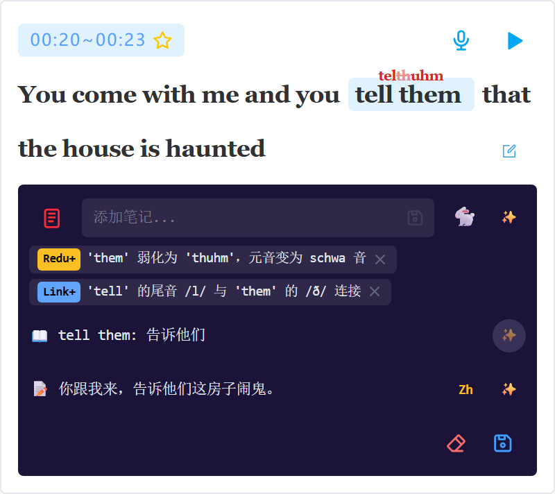

# Lingua Workbench 🎧

A personal language learning platform for analyzing and studying spoken English from audio sources like TV shows and movies.


## ✨ Features

### 🎵 Audio Management
- **Source Audio Upload**: Upload audio files organized by drama/season/episode
- **Auto Chunking**: Automatically splits long audio into 5-minute chunks
- **Waveform Visualization**: Interactive waveform with region selection

### ✂️ Audio Slicing & Annotation
- **Region Selection**: Click and drag on waveform to create audio slices
- **Whisper Transcription**: AI-powered speech-to-text transcription
- **Text Highlighting**: Select text to create highlights for deeper analysis


### 🔊 Sound Script Analysis
Sound Script provides AI-generated phonetic breakdown of spoken phrases, showing how words are actually pronounced in connected speech:

| Tag | 中文 | Description |
|-----|------|-------------|
| Reduction | 弱化 | Vowel reduced to schwa |
| Linking | 连读 | Consonant-vowel linking across words |
| Assimilation | 同化 | Sound changes due to adjacent sounds |
| H-deletion | H删除 | Initial /h/ dropped in function words |
| Flap T | 闪音T | T/D flapped between vowels |
| Glottal Stop | 喉塞音 | T replaced with glottal stop |

**Sound Display Notation**:
- Phonetic spelling (e.g., "wuh-duh-we" for "what do we")
- ~~Strikethrough~~ for ghost/silent sounds
- Ruby text showing pronunciation above original text


### 📖 Dictionary Integration
- **AI Dictionary Lookup**: Context-aware definitions for words/phrases
- **Bilingual Examples**: Example sentences in both English and Chinese
- **Example Refresh**: Generate new contextual examples on demand



### 🛠️ Editing Capabilities
- **Dual Edit Modes**: 
  - **AI Note Mode**: Edit phonetic tags and notes
  - **Sound Display Mode**: Correct AI's pronunciation analysis
- **Time Adjustment**: Fine-tune slice boundaries with ±0.5s arrows
- **Favorite Marking**: Star important sentences for review


### 🎛️ Playback Controls
- **Variable Speed**: 0.5x - 1.5x playback speeds
- **Loop Playback**: Repeat audio regions for practice
- **Region Playback**: Click to play individual slices

## 🏗️ Tech Stack

### Frontend
| Technology | Purpose |
|------------|---------|
| Vue 3 | UI framework with Composition API |
| TypeScript | Type-safe JavaScript |
| Vite | Build tool and dev server |
| Element Plus | UI component library |
| Tailwind CSS | Utility-first CSS |
| WaveSurfer.js | Audio waveform visualization |
| Pinia | State management |
| Axios | HTTP client |

### Backend
| Technology | Purpose |
|------------|---------|
| Django | Web framework |
| Django REST Framework | API development |
| SimpleJWT | JWT authentication |
| LangChain | LLM orchestration |
| OpenAI API | AI analysis and dictionary |

### Services
| Service | Purpose |
|---------|---------|
| Whisper API | Speech-to-text transcription |
| OpenAI GPT-4 | Phonetic analysis and examples |

## 📁 Project Structure

```
lingua-workbench/
├── frontend/                # Vue 3 frontend
│   ├── src/
│   │   ├── api/            # API client functions
│   │   ├── components/     # Vue components
│   │   ├── views/          # Page views
│   │   └── stores/         # Pinia stores
│   └── package.json
├── backend/                 # Django backend
│   ├── audio_slicer/       # Audio management app
│   ├── ai_analysis/        # AI analysis app
│   └── requirements.in
├── whisper/                 # Whisper API service
├── docs/                    # Documentation
│   ├── dita/               # DITA source files
│   └── screenshots/        # Product screenshots
└── playwright-screenshots/  # Automated screenshot tool
```

## 🔧 Developer Documentation

For developers contributing to the codebase, detailed component architecture documentation is available:

| Component | Description | Docs |
|-----------|-------------|------|
| `BaseWaveSurfer` | Waveform visualization & region management | [Architecture](./docs/dita/topics/developer/wavesurfer/c_basewavesurfer.dita) |
| `AudioSlicer` | Region selection workspace & slice persistence | [Architecture](./docs/dita/topics/developer/audioslicer/c_audioslicer.dita) |
| `SliceCard` | Audio slice editing with highlighting & AI | [Architecture](./docs/dita/topics/developer/slicecard/c_slicecard.dita) |

**Composables:**

| Composable | Description | Docs |
|------------|-------------|------|
| `useRecording` | Microphone recording & playback | [Architecture](./docs/dita/topics/developer/composables/c_userecording.dita) |
| `useTranscription` | Whisper API transcription | [Architecture](./docs/dita/topics/developer/composables/c_usetranscription.dita) |
| `useHighlightSelection` | Text selection & highlight creation | [Architecture](./docs/dita/topics/developer/composables/c_usehighlightselection.dita) |

> The waveform is the foundation of all audio interactions. See [jottings/BaseWaveSurfer.md](./jottings/BaseWaveSurfer.md) for detailed API reference.

## 🚀 Getting Started

### Prerequisites
- Node.js 20+
- Python 3.11+
- ffmpeg (for audio processing)

### Frontend Setup
```bash
cd frontend
npm install
npm run dev
```

### Backend Setup
```bash
cd backend
python -m venv venv
venv\Scripts\activate  # Windows
pip install -r requirements.txt
python manage.py migrate
python manage.py runserver
```

### Environment Variables
Create `.env` files for both frontend and backend:

**Backend `.env`:**
```
SECRET_KEY=your-secret-key
DEBUG=True
OPENAI_API_KEY=your-openai-key
```

## 📸 Screenshots

| Feature | Screenshot |
|---------|------------|
| Audio Slice |  |
| Transcription |  |
| Text Highlight |  |
| Sound Analysis |  |
| Dictionary |  |
| Completed |  |

## 📝 License

MIT License - See [LICENSE](./LICENSE) for details.

---

*Built for language learners who want to master natural spoken English through authentic audio sources.* 🌟
