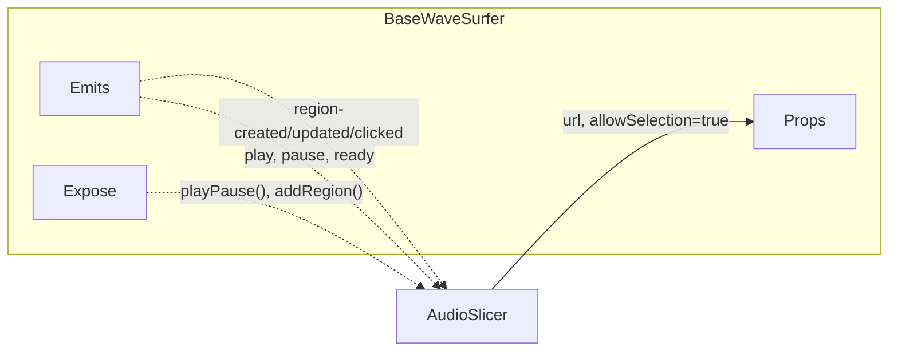
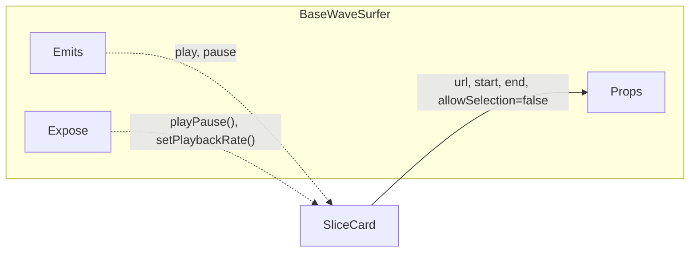

# BaseWaveSurfer.vue

基于 [WaveSurfer.js](https://wavesurfer.xyz/) 的音频波形可视化组件，支持区域选择和循环播放。

## 数据流

### AudioSlicer ↔ BaseWaveSurfer



> 用户在主波形上**拖拽创建多个 regions**，父组件监听事件管理区域列表。

### SliceCard ↔ BaseWaveSurfer



> 卡片内显示**固定片段的哨兵区域**，支持循环播放和变速。

## 使用场景

| 场景 | 父组件 | Props | 功能 |
|-----|-------|-------|------|
| **主波形** | `AudioSlicer` | `url` | 用户拖拽创建多个 regions |
| **卡片内波形** | `SliceCard` | `url`, `start`, `end` | 显示固定片段，循环播放 |

---

## Props

| Prop | Type | Default | Description |
|------|------|---------|-------------|
| `url` | `string` | **required** | 音频文件 URL |
| `height` | `number` | `90` | 波形高度 (px) |
| `start` | `number` | - | 哨兵区域起始时间 (秒) |
| `end` | `number` | - | 哨兵区域结束时间 (秒) |
| `allowSelection` | `boolean` | `true` | 是否允许拖拽创建区域 |

> [!NOTE]
> 当同时传入 `start` 和 `end` 时，组件会创建一个**哨兵区域**（`managedRegion`），用于 SliceCard 场景。

---

## Emits

| Event | Payload | Description |
|-------|---------|-------------|
| `region-created` | `Region` | 用户创建新区域（不含哨兵区域） |
| `region-updated` | `Region` | 区域被拖拽/调整 |
| `region-removed` | `Region` | 区域被删除 |
| `region-in` | `Region` | 播放进入区域 |
| `region-out` | `Region` | 播放离开区域 |
| `region-clicked` | `Region, MouseEvent` | 区域被点击 |
| `play` | - | 开始播放 |
| `pause` | - | 暂停播放 |
| `ready` | `WaveSurfer` | WaveSurfer 初始化完成 |

---

## Expose (ref 方法)

通过 `ref` 调用组件方法：

```vue
<BaseWaveSurfer ref="wavesurferRef" :url="audioUrl" />

<script setup>
const wavesurferRef = ref(null)

// 调用方法
wavesurferRef.value?.playPause()
</script>
```

| Method | Returns | Description |
|--------|---------|-------------|
| `playPause()` | `void` | 切换播放/暂停 |
| `play()` | `void` | 智能播放（自动跳到区域起点） |
| `pause()` | `void` | 暂停 |
| `getRegions()` | `Record<string, Region>` | 获取所有区域 |
| `addRegion(options)` | `Region` | 添加区域 |
| `setPlaybackRate(rate)` | `void` | 设置播放速度 |

---

## 内部状态

| State | Type | Description |
|-------|------|-------------|
| `wavesurfer` | `WaveSurfer` | WaveSurfer 实例 |
| `wsRegions` | `RegionsPlugin` | Regions 插件实例 |
| `selectedRegion` | `Region` | 当前选中的区域 |
| `managedRegion` | `Region` | 哨兵区域（SliceCard 场景） |

---

## 哨兵区域 (Managed Region)

当传入 `start` 和 `end` 时，组件创建一个 ID 为 `'start-end-segment'` 的特殊区域：

```typescript
const REGION_ID = 'start-end-segment'
```

**作用：**
1. **视觉高亮** - 橙色半透明显示选中范围
2. **循环播放** - 播放到 `end` 时自动跳回 `start`
3. **智能起点** - 点击播放时自动跳到区域开头

**过滤机制：** 哨兵区域的 `region-created` 事件不会 emit 给父组件，避免干扰用户创建的区域。

**智能缩放：** 创建哨兵区域时，会自动计算缩放级别使区域占据约 70% 视口宽度（`segmentDuration * 1.4` padding）。

---

## Watch 响应式行为

组件会响应 Props 变化并自动更新：

| Prop | 变化时行为 |
|------|------------|
| `height` | 调用 `setOptions({ height })` 更新波形高度 |
| `url` | 重新加载音频，清空 `selectedRegion` |
| `start` / `end` | 删除旧哨兵区域，重建新区域，重新缩放和定位 |

---

## WaveSurfer.js API 速查

本组件封装了 [WaveSurfer.js](https://wavesurfer.xyz/)，以下是用到的核心 API：

### WaveSurfer 实例方法

| 方法 | 说明 |
|-----|------|
| `on(event, callback)` | 监听 WaveSurfer 事件（如 `play`, `pause`, `ready`, `audioprocess`） |
| `seekTo(progress)` | 跳转到指定位置，`progress` 为 0-1 的比例值 |
| `getDuration()` | 获取音频总时长（秒） |
| `getCurrentTime()` | 获取当前播放位置（秒） |
| `isPlaying()` | 返回是否正在播放 |
| `play()` / `pause()` | 播放 / 暂停 |
| `setPlaybackRate(rate)` | 设置播放速度 |
| `zoom(pxPerSec)` | 设置缩放级别（像素/秒） |
| `registerPlugin(plugin)` | 注册插件（如 RegionsPlugin） |
| `destroy()` | 销毁实例，释放资源 |

### WaveSurfer 事件

| 事件 | 触发时机 |
|-----|---------|
| `ready` | 音频加载完成，波形渲染完毕，**实例可用** |
| `play` | 开始播放 |
| `pause` | 暂停播放 |
| `audioprocess` | 播放过程中持续触发，参数为当前时间（用于手动循环） |
| `error` | 加载或播放出错 |

---

## RegionsPlugin API 速查

通过 `registerPlugin(RegionsPlugin.create())` 注册后可用。

> Regions 是波形图上的**视觉覆盖区域**，可用于播放、循环音频的特定区段，支持拖拽和调整大小。

### 插件方法

| 方法 | 说明 |
|-----|------|
| `addRegion(options)` | 添加区域，返回 `Region` 对象 |
| `getRegions()` | 获取所有区域 `Record<string, Region>` |
| `clearRegions()` | 移除所有区域 |
| `enableDragSelection(options)` | 启用拖拽选区创建 Region |


### Region 方法

| 方法 | 说明 |
|-----|------|
| `remove()` | 删除 `Region` 对象 |

### Region 事件

| 事件 | 说明 |
|-----|------|
| `region-created` | 区域被创建 |
| `region-updated` | 区域被拖拽/调整大小 |
| `region-removed` | 区域被删除 |
| `region-in` | 播放进入区域范围 |
| `region-out` | 播放离开区域范围 |
| `region-clicked` | 区域被点击 |

> [!TIP]
> 完整 Options 参考：https://wavesurfer.xyz/plugins/regions

---

## 样式说明

组件使用 Shadow DOM 样式穿透来隐藏滚动条：

```css
.wavesurfer-host :deep(::part(scroll)) {
  scrollbar-width: none;
}
```

---

## 开发者注意事项

> [!WARNING]
> **TypeScript 类型问题**：`WaveSurfer.create()` 返回的是结构类型，而非 `WaveSurfer` 类类型。在 emit `ready` 事件时需要显式类型断言：
> ```typescript
> emit('ready', wavesurfer.value! as WaveSurfer)
> ```
