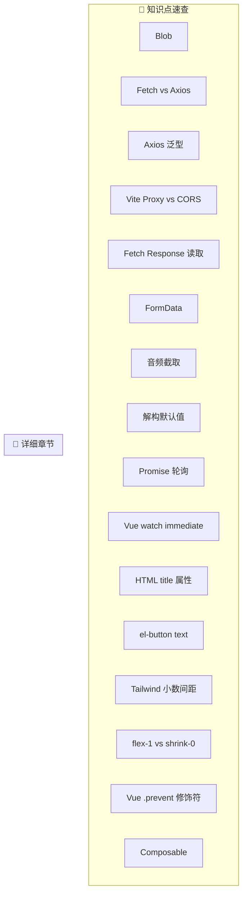

# 知识图谱

> 自动生成于 2026/1/14 15:20:26

```mermaid
flowchart TB
  subgraph QuickRef["📌 知识点速查"]
    k0["Blob"]
    k1["Fetch vs Axios"]
    k2["Axios 泛型"]
    k3["Vite Proxy vs CORS"]
    k4["Fetch Response 读取"]
    k5["FormData"]
    k6["音频截取"]
    k7["解构默认值"]
    k8["Promise 轮询"]
    k9["Vue watch immediate"]
    k10["HTML title 属性"]
    k11["el-button text"]
    k12["Tailwind 小数间距"]
    k13["flex-1 vs shrink-0"]
    k14["Vue .prevent 修饰符"]
    k15["Composable"]
  end

  subgraph Details["📖 详细章节"]
  end

  %% 关联
```

## 使用方法

1. 在 VS Code 中安装 "Markdown Preview Mermaid Support" 插件
2. 或者在 Obsidian 中直接预览
3. 或者粘贴到 [Mermaid Live Editor](https://mermaid.live)
