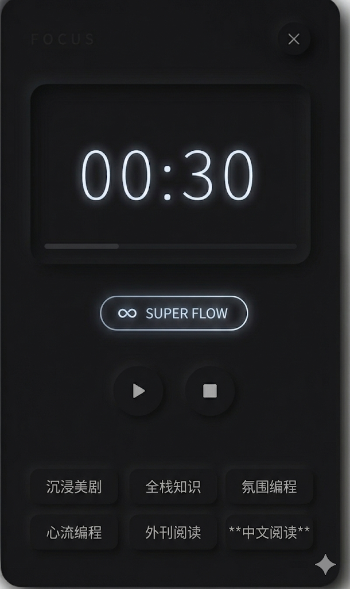

# 任务目标：开发 Lingua Workbench 的极简专属 Focus Timer (番茄钟)

请帮我更新番茄钟 Widget，并提供对应的 Django Models 设计。

## 1. 视觉风格 (Titanium Dark Neumorphism)
- 保持现有风格；并且对专注时间调节刻度尺的 UI 也使用这个风格。

## 2. 前端状态机与核心逻辑 (Pinia Store)
番茄钟包含三个核心状态 (State Machine)：`IDLE` (待机), `WORK` (专注中), `REST` (休息中)。
- **工作流**：
  - `IDLE` -> 点击开始 -> 进入 `WORK` 状态进行倒数。
  - `WORK` 倒数归零 -> **触发后端 API 保存记录** -> 自动切换为 `REST` 状态，时间重置为 5 分钟并自动倒数。
  - `REST` 倒数归零 -> 切换回 `IDLE` 状态。
  - `REST` 开始和结束播放提示音，不需要 Alert。
  - 专注时间下方添加一个“超级心流”的图标按钮（类似⚡或者 ∞ ），如果选中了这个模式，不需要手动从 `REST` 进入 `WORK`，而是会直接进入 `WORK` 状态。
  
- **废弃动作 (Discard)**：
  - 提供一个强制重置按钮 (⏹)。点击后立刻回到 `IDLE` 状态，**不向后端发送任何 API 请求**。

## 3. 标签矩阵 (Tags)
- 从后端 `PomodoroTag` 表获取标签。而不是从 PiniaStore。
- UI 上呈现为一个极其规整的 3x2 四字中文矩阵，而不是现在的 2x3。

## 4. 刻度尺时间调节交互 (Slide-up Ruler)
- **呼出方式**：在 `IDLE` 状态下，点击数字显示屏，从 Widget 底部平滑向上滑出一个带物理弹性的刻度面板。
- **交互逻辑 (非拖拽)**：
  - 面板上显示 `[15, 20, 25, 30, 35, 40, 45, 50, 55, 60]` 这几个时间选项。
  - 不使用鼠标拖动。用户点击任意数字（如 45），整个刻度轨道使用 CSS `transform: translateX` 加上平滑过渡动画，自动将“45”滑动至正中央的白色对齐指针下方。
- 点击“DONE”按钮收起面板，并更新当前倒计时时间。
- 默认：40分钟

## 5. 后端架构 (Django Models)
由于前端处理了“休息”逻辑，后端只负责冷酷地记录“产生了价值的专注产出”。不需要记录休息时间。
- **`PomodoroTag` 表**：
  - `name`: CharField (标签名)
  - `order`: IntegerField (用于维持 3x2 矩阵的顺序)
- **`Pomodoro` 表**：
  - `created_at`: DateTimeField (按下开始键的瞬间)
  - `completed_at`: DateTimeField (专注倒计时自然结束的瞬间)
  - `duration`: IntegerField (设定的专注时长，分钟)
  - `tag`: ForeignKey -> PomodoroTag
  - `task`: CharField (预留字段，允许为空，用于日后复盘时手动补全专注细节)
  - `status`: CharField (默认为 completed)

请先更新 Vue 3 的组件代码和对应的 CSS，然后输出 Django 的 models.py 代码。