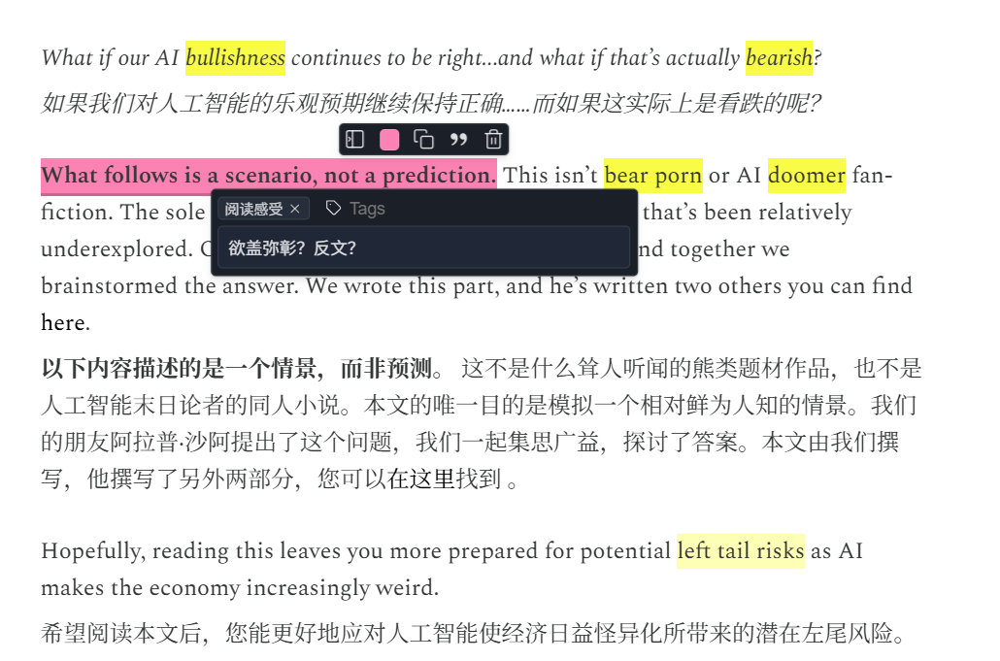

🏗️ Lingua Workbench - 阅读模块技术蓝图
一、 数据获取层 (Data Acquisition)
核心策略：放弃后端强行爬取，采用“前端寄生”模式绕过所有反爬和付费墙。

形态：专属的极简 Chrome 扩展 (Chrome Extension)。

关键 JS 库：Readability.js (Mozilla 维护，Safari 阅读模式的底层库)。

工作流：在目标网页点击插件 -> Readability.js 瞬间剥离广告、导航栏，提取纯净的正文 HTML/Text -> 扩展程序将数据通过 API POST 到你的 Django 后端。

二、 后端数据模型 (Django Models)
核心策略：化整为零，将长文打碎成段落，为高精度的 AI 问答和局部渲染打基础。

Article (文章表)

基础：title, url, author, raw_html

✨ 新增核心：meta_context (JSON 字段)。存入时由 LLM 一次性生成，包含 {"domain": "金融宏观", "tone": "华尔街分析师", "outline": [...]}。

Paragraph (段落表)

字段：article (外键), index (排序号), content (段落文本)。

Annotation (多态批注表)

字段：paragraph (外键), selected_text, user_note (用户的碎碎念/感悟)。

✨ 多态核心：type (黄标 Jargon / 蓝标 Usage / 粉标 Thought) 以及对应的 color。

三、 AI 引擎调度 (LLM Architecture)
核心策略：告别单一的“划词翻译”，根据文章基因和划线颜色，动态切换 AI 角色。

第一步：全局初始化 (On Import)

文章入库时，后台静默请求一次大模型。

Prompt 目标：阅读全文，输出包含文章逻辑骨架（Outline）和文章领域属性（Domain/Tone）的 JSON。

第二步：动态伴读 (On Annotation)

当你在前端划选并按下 Ctrl + Enter 时，后端根据颜色组装不同的 Prompt：

🟡 黄标 (硬核术语)：调用 meta_context 中的领域属性，用该领域的逻辑解释黑话（例如解释什么是 duration risk）。

🔵 蓝标 (语用精进)：化身语言学家，剖析常见词在这里的高阶用法，并提供原生例句。

🌸 粉标 (灵魂探讨)：读取 user_note 中你记录的感悟（比如“欲盖弥彰？”），结合段落上下文，像苏格拉底一样回应你的批判性思考。

四、 前端交互与排版 (Vue 3 UI)
核心策略：左侧沉浸阅读，右侧智能交互，解决重叠高亮的痛点。

布局：左右分栏结构。左侧是干净的文章正文，右侧面板保留 Copilot 聊天框，并新增一个 Outline (大纲导航) Tab。

关键 JS 库候选 (解决划词高亮难题)：

方案 A (Mark.js)：如果你只需要在纯文本上做简单的高亮和背景色填充，这个库非常轻量且开箱即用。

方案 B (ProseMirror 或 TipTap)：如果你希望左侧的阅读器像 Notion 一样极其丝滑，且能完美处理一句话里既有黄标生词、又被整体打上粉标的“重叠高亮 (Overlapping Marks)”问题，直接上富文本编辑器的底层架构。

交互细节：选中文字后，弹出一个极简的 Popover 工具栏，显示 🟡 🔵 🌸 三个色块。点击色块，唤起悬浮输入框记录你的灵感，最后 Ctrl + Enter 发送给 Copilot。

